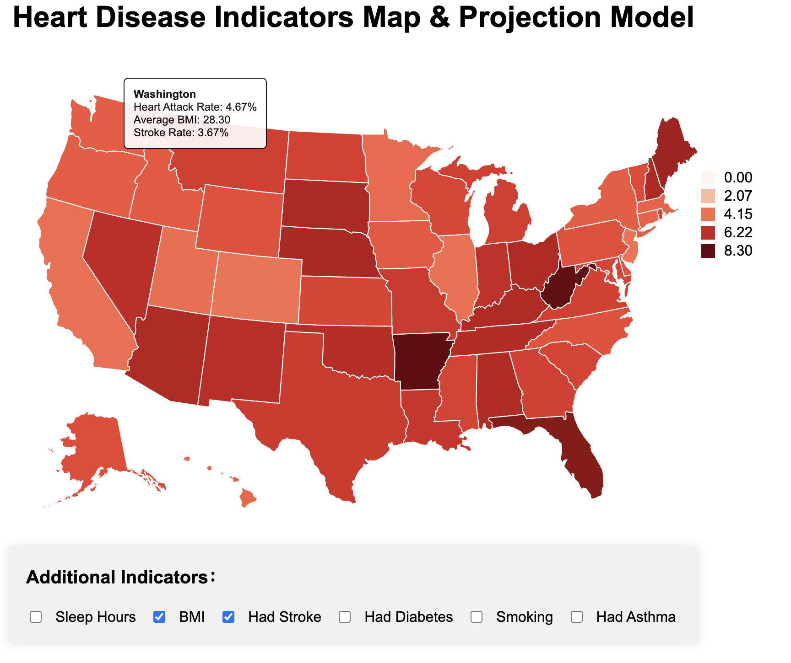
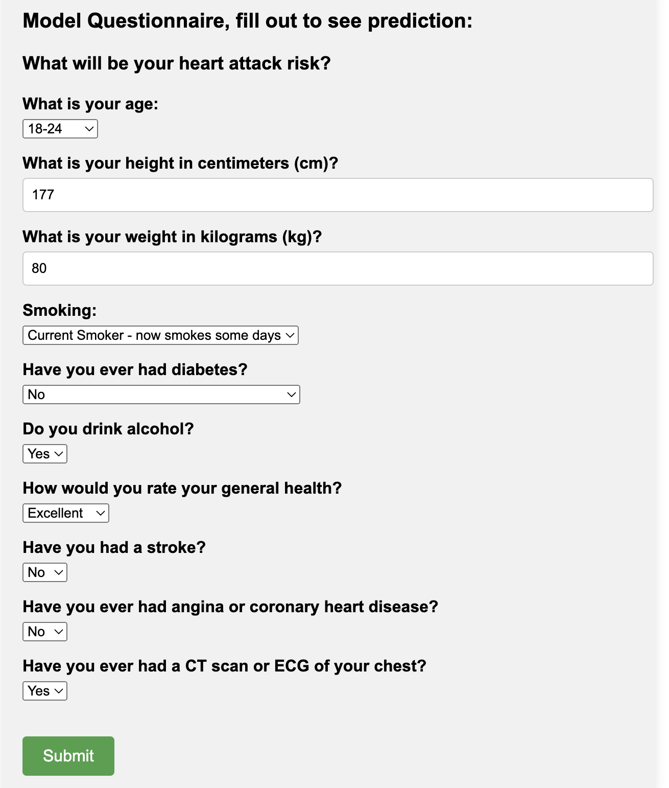
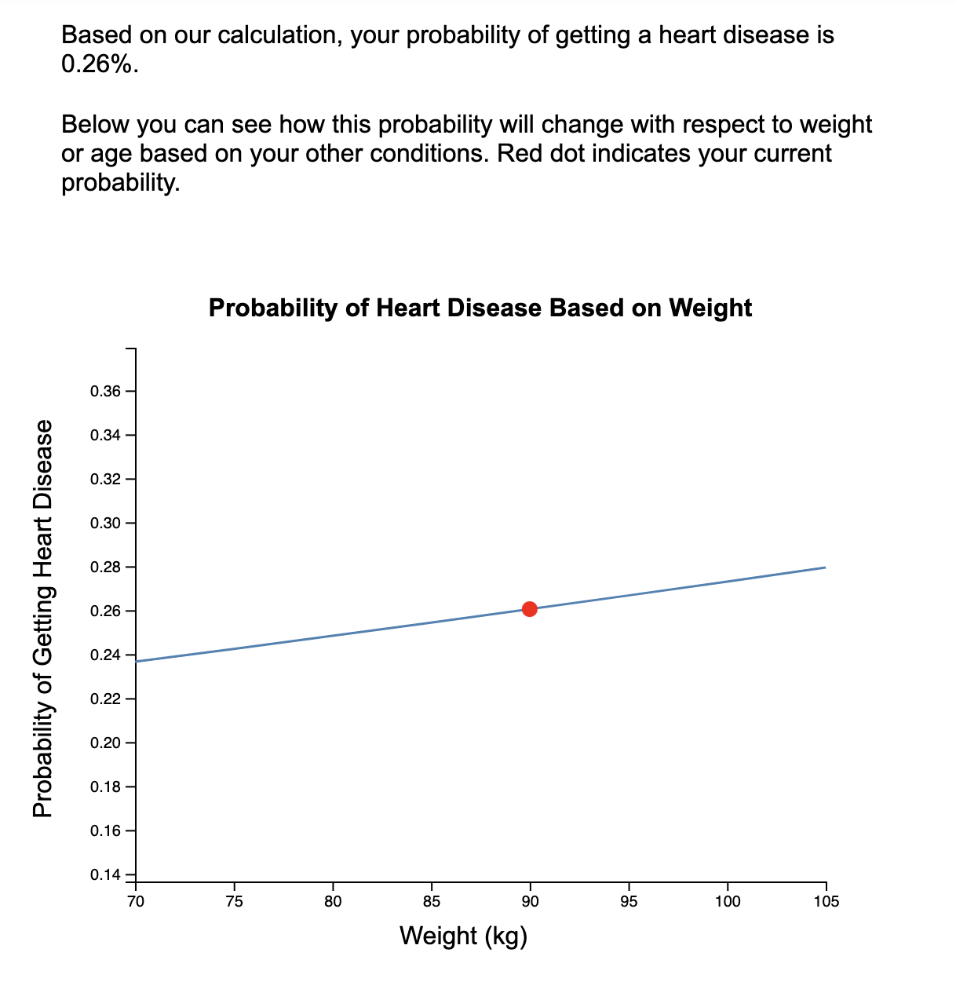
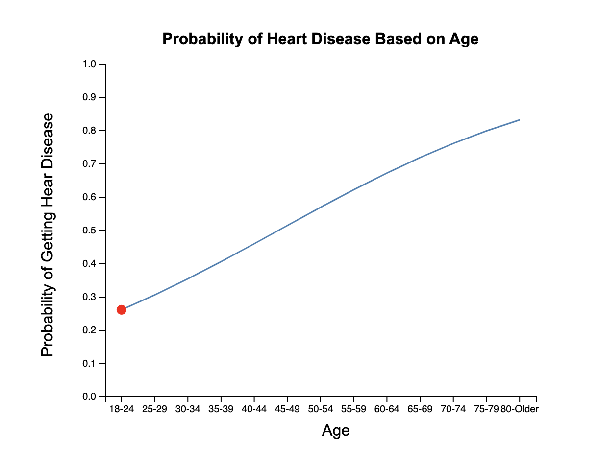

# Heart_Disease_Indicator

## Introduction

Our study proposes to revolutionize heart disease prediction and intervention accuracy by leveraging extensive datasets and advanced data analysis tools. We plan to utilize machine learning algorithms and visualizations to develop a prediction model that helps the audiences to see whether they are in high risks of getting heart disease. We implemented interactive visualizations to help people understand our model outputs with various factors.

## Visualization

Our interactive visualization contains two parts.

First visualization is a map view, allow the audience to see the percentage of population getting the heart disease in different states.

Mouse hovering to each state, the audience can see the other detail information regarding health related conditions that might serve as heart disease indicators.

<!-- include screenshot here -->

Second visualization consists of two line charts. First, you fill out the questionnaire:

Then, two line charts will be generated.

    
    

## Setting up the dataset

Use `https://github.com/ZilUZhU/Heart_Disease_Indicator.git` to download the code.

Unzip the data2020.csv.zip to get data2020.csv. (Or heart_2022_with_nans.csv)

Run regression_oversample.ipynb to load the data and train the model

## Run the page

In the main directory, run `python http.server`.

In another terminal, run `python server.py`

Server will be hosted at `port 8000` by default. In any browser, open localhost [http://localhost:8000](http://localhost:8000).

Click open [/visualization](http://localhost:8000/visualization/) to see interactive visualization.

## About Model

Model.py contains the code of logistic regression model.  

#### Deep Learning Model (PyTorch)

- **Data Processing**: Standardize and encode features to prepare data for neural network processing.
- **Architecture**: Multi-layer architecture including three fully connected layers and a custom attention layer to enhance focus on critical features.
- **Training**: Utilize the Adam optimizer and cross-entropy loss function, employing backpropagation for model optimization.
- **Output**: Softmax function in the final layer provides probabilistic outcomes for disease presence.

#### Logistic Regression Model

- **Data Processing**: Similar preprocessing as the deep model to ensure compatibility with the logistic regression algorithm.
- **Model Setup**: Utilize logistic regression to directly model the probability of heart disease based on linear combinations of input features.
- **Training**: Employ cross-entropy loss and gradient descent for parameter estimation.
- **Output**: Outputs a probability score indicating the likelihood of heart disease.

#### Key Features

- **Deep Learning Model**: Captures complex patterns and interactions through deep neural structures, enhanced by attention mechanisms for prioritizing informative features.
- **Logistic Regression**: Offers a straightforward and computationally efficient approach, ideal for scenarios with limited data or computing resources.

These models are designed to address various operational settings, ensuring flexibility in deployment and applicability in diverse healthcare environments.

