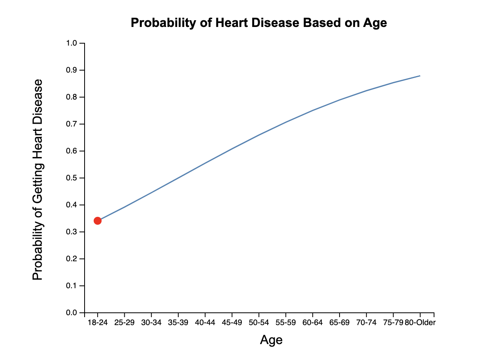

# Heart_Disease_Indicator

## Introduction

Our study proposes to revolutionize heart disease prediction and intervention accuracy by leveraging extensive datasets and advanced data analysis tools. We plan to utilize machine learning algorithms and visualizations to develop a prediction model that helps the audiences to see whether they are in high risks of getting heart disease. We implemented interactive visualizations to help people understand our model outputs with various factors.

## Visualization

Our interactive visualization contains two parts.

First visualization is a map view, allow the audience to see the percentage of population getting the heart disease in different states.

Mouse hovering to each state, the audience can see the other detail information regarding health related conditions that might serve as heart disease indicators.

<!-- include screenshot here -->

Second visualization consists of two line charts. First, you fill out the questionnaire:

Then, two line charts will be generated.

## Setting up the dataset

Use `https://github.com/ZilUZhU/Heart_Disease_Indicator.git` to download the code.

Unzip the data2020.csv.zip to get data2020.csv. 

Run regression_oversample.ipynb to load the data and train the model

## Run the page

In the main directory, run `python http.server`.

In another terminal, run `python server.py`

Server will be hosted at `port 8000` by default. In any browser, open localhost [http://localhost:8000](http://localhost:8000).

Click open [/visualization](http://localhost:8000/visualization/) to see interactive visualization.

## About Model

Model.py contains the code of logistic regression model.  

